[Български](README.md) · [English](README.en.md)

# Мрежово управление на корпоративна инфраструктура с отдалечени офиси

Практическа реализация на система за мрежово наблюдение, централизирано логване, 
IP адресно управление и частна облачна услуга за симулирана корпоративна мрежа 
с отдалечени офиси, свързани чрез криптирана VPN мрежа.

*Проектът е разработен като бакалавърска дипломна работа (ТУ - Варна, 2026).*

---

## Съдържание
- [За проекта](#за-проекта)
- [Портове и услуги](#портове-и-услуги)
- [Мрежова топология](#мрежова-топология)
- [1. Централизиран Syslog сървър](#1-централизиран-syslog-сървър)
- [2. Система за IP адресно управление (NetBox)](#2-система-за-ip-адресно-управление-netbox)
- [3. Система за мрежово наблюдение (Netdata, Prometheus, Grafana)](#3-система-за-мрежово-наблюдение-netdata-prometheus-grafana)
- [4. Частна облачна услуга (Nextcloud)](#4-частна-облачна-услуга-nextcloud)
- [Пълна документация](#пълна-документация)

---

## За проекта

Проектът е част от съвместна екипна разработка, симулираща корпоративна мрежа
с централен офис и два отдалечени клона (модел Hub-and-Spoke), свързани чрез
криптирана VPN мрежа (ZeroTier). Общата инфраструктура е изградена във
виртуална среда чрез GNS3 и MikroTik RouterOS маршрутизатори.

**Моят самостоятелен принос** обхваща периферния Linux-базиран офис:
- Централизирана система за събиране на системни съобщения (Syslog) с автоматизиран модул за реакция при критични събития
- Система за управление на IP адресното пространство / IPAM (NetBox)
- Система за мрежово наблюдение в реално време (Netdata, Prometheus, Grafana)
- Частна облачна услуга (Nextcloud) с интеграция към Active Directory и Windows файлово хранилище

## Портове и услуги

| Услуга | Порт | Роля |
|---|---|---|
| Nextcloud | 443 (HTTPS) | Частна облачна услуга |
| NetBox | 8000 | IPAM / Source of Truth |
| Prometheus | 9090 | Събиране на телеметрия |
| Grafana | 3000 | Визуализация |
| Netdata | 19999 | Real-time мониторинг |
| Node Exporter | 9100 | Linux метрики |
| Windows Exporter | 9182 | Windows метрики |
| Syslog (UDP) | 514 | Централизирано логване |

## Мрежова топология

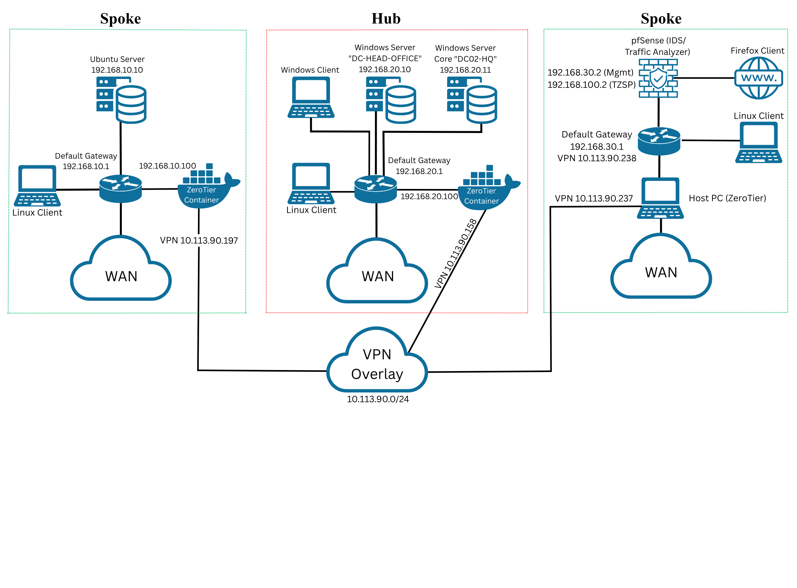

Централен офис (Windows AD) и два отдалечени клона (Linux инфраструктура —
моята част от проекта, и Security инфраструктура), свързани чрез VPN Overlay мрежа.

---

## 1. Централизиран Syslog сървър

Изграден чрез rsyslog на Ubuntu Server — приема UDP съобщения на порт 514
от MikroTik маршрутизаторите. Виж [`configs/rsyslog/rsyslog.conf`](configs/rsyslog/rsyslog.conf).

Допълнен с два автоматизирани bash скрипта:
- [`scripts/alert_monitor.sh`](scripts/alert_monitor.sh) — филтрира критични
  събития (неуспешни опити за вход) в реално време, записва ги в отделен
  архив, изпраща broadcast известие до всички активни администраторски
  сесии и симулира изпращане на email
- [`scripts/ad-watchdog.sh`](scripts/ad-watchdog.sh) — следи наличността
  на Active Directory сървъра и автоматично включва/изключва LDAP
  интеграцията в Nextcloud при прекъсване на връзката

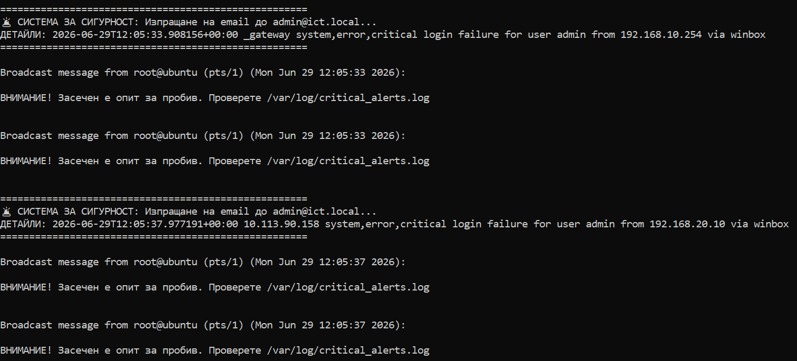

*Автоматична broadcast аларма при засечен неуспешен опит за вход*

## 2. Система за IP адресно управление (NetBox)

Централизиран "източник на истината" (Source of Truth) за мрежовото
адресно пространство, изграден чрез Docker версията на NetBox. Виж
[`configs/netbox/docker-compose.override.yml`](configs/netbox/docker-compose.override.yml).

Документирани са трите локации (Sites), мрежовите префикси, IP адресите
на устройствата и мрежовите услуги. Платформата активно предотвратява
дублиране на IP адреси в адресното пространство:

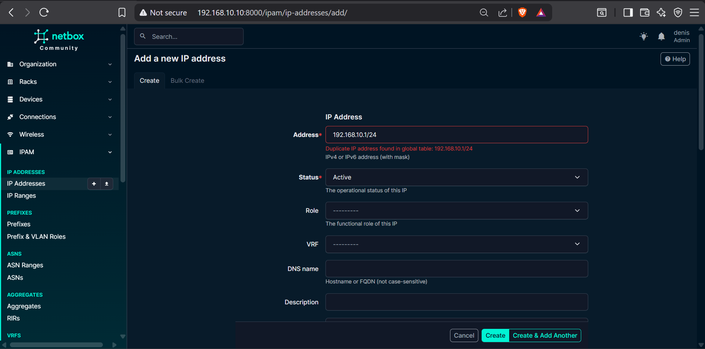

*NetBox блокира опит за въвеждане на вече използван IP адрес*

Още скрийншотове от NetBox

 

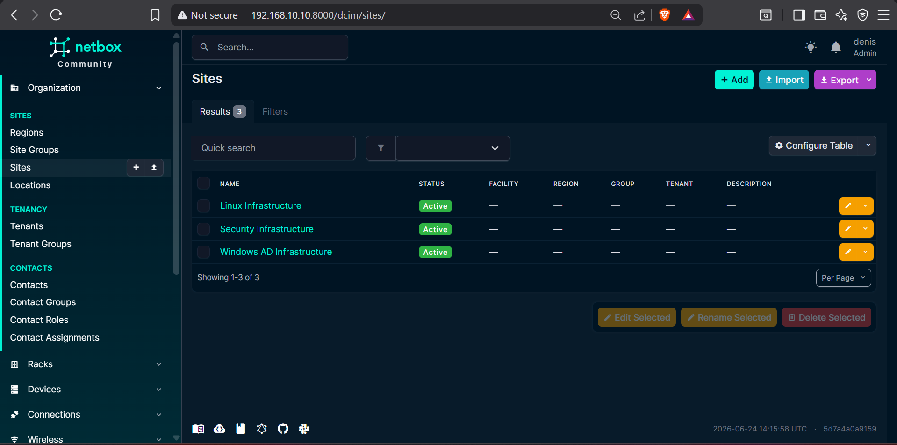

*Дефинирани локации (Sites) в топологията*

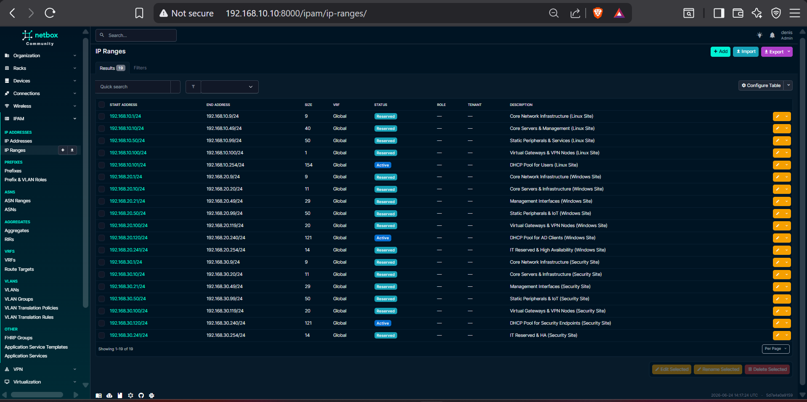

*Регистър на IP адресите*

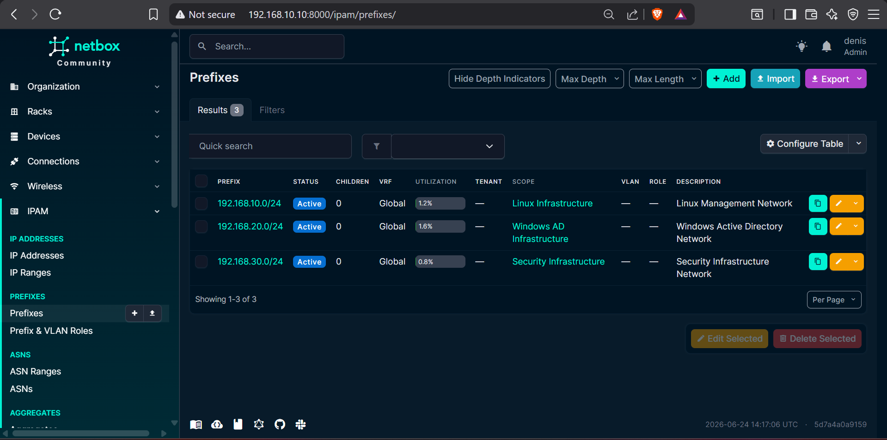

*Мрежови префикси по локация*

## 3. Система за мрежово наблюдение (Netdata, Prometheus, Grafana)

Трислойна архитектура за мониторинг в реално време:

- **Netdata** — мониторинг с висока разделителна способност (1 сек.) на
  системните ресурси, достъпен на порт 19999. Виж
  [`scripts/deploy-netdata.sh`](scripts/deploy-netdata.sh).
- **Prometheus** — централизирано събиране на телеметрия чрез pull модел
  от Linux сървъра (Node Exporter, порт 9100) и отдалечения Windows сървър
  (Windows Exporter, порт 9182). Виж
  [`configs/prometheus/prometheus.yml`](configs/prometheus/prometheus.yml) и
  [`scripts/deploy-prometheus.sh`](scripts/deploy-prometheus.sh).
- **Grafana** — визуализация чрез готови dashboard шаблони (Node Exporter
  Full - ID 1860, Windows Exporter - ID 14510). Виж
  [`scripts/deploy-grafana.sh`](scripts/deploy-grafana.sh).

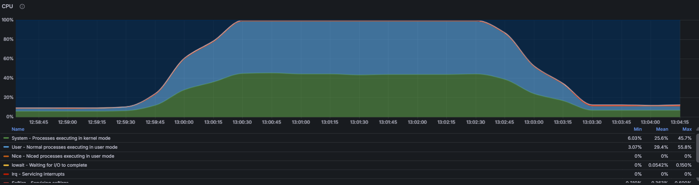

*Тест с изкуствено генерирано натоварване — Grafana отчита промяната в реално време*

<table>
<tr>
<td>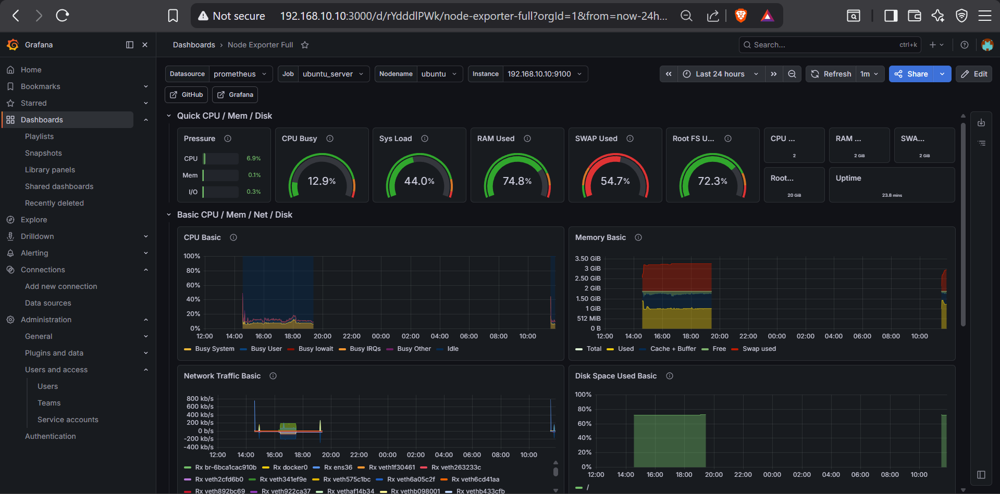</td>
<td>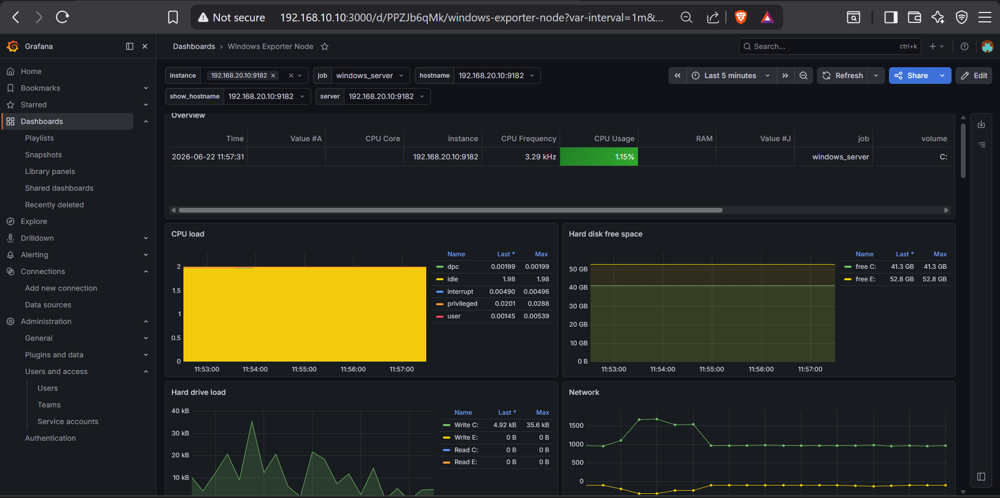</td>
</tr>
<tr>
<td align="center"><i>Linux сървър</i></td>
<td align="center"><i>Windows сървър</i></td>
</tr>
</table>

Още скрийншотове от мониторинг стека

 

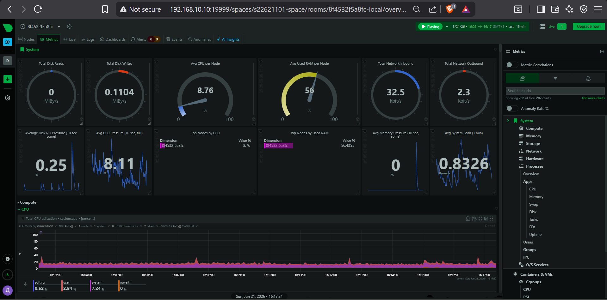

*Netdata - мониторинг на сървърните ресурси в реално време*

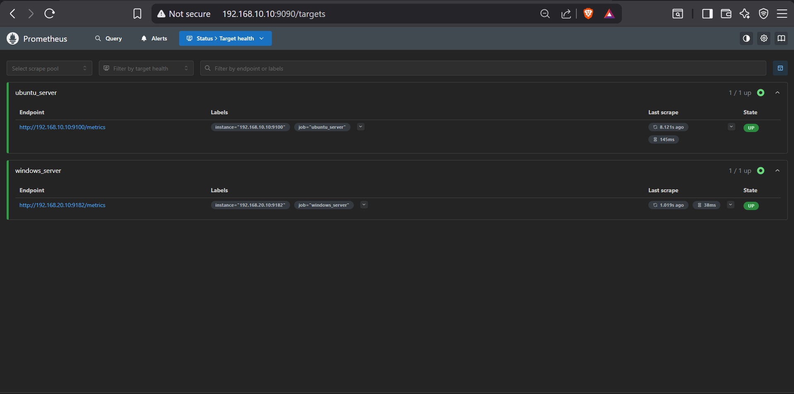

*Prometheus - статус на наблюдаваните цели (UP)*

## 4. Частна облачна услуга (Nextcloud)

Внедрена чрез Snap пакет с HTTPS (self-signed сертификат за затворена
лабораторна мрежа). Виж [`scripts/install-nextcloud.sh`](scripts/install-nextcloud.sh).

Интегрирана с:
- **Active Directory** през LDAPS (порт 636) — централизирано удостоверяване
  на потребителите с техните домейнски имена и пароли. Виж
  [`configs/nextcloud/ldap-settings.md`](configs/nextcloud/ldap-settings.md).
- **Windows файлово хранилище** през SMB/CIFS, монтирано като External
  Storage. Виж [`configs/nextcloud/cifs-mount-example.sh`](configs/nextcloud/cifs-mount-example.sh).

Достъпът е разпределен по отдели чрез Active Directory групи — всеки
потребител вижда само ресурсите на своя отдел:

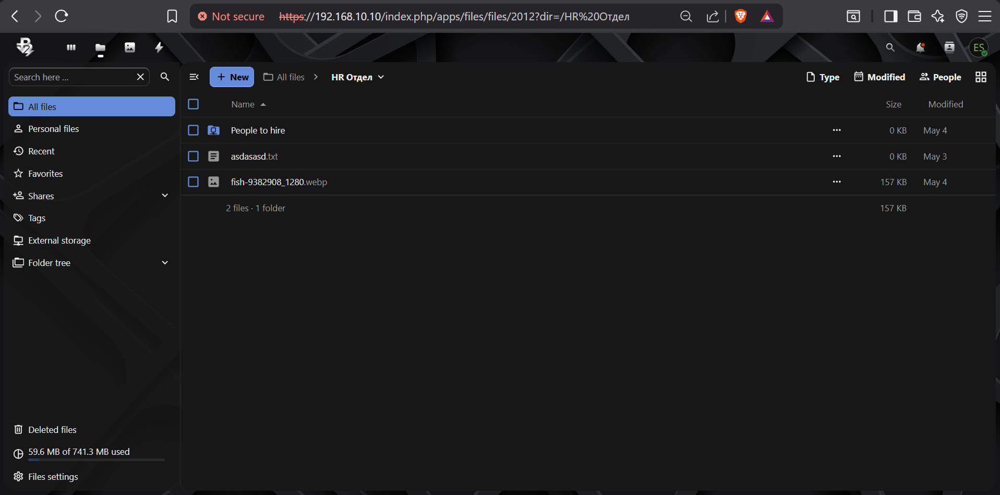

*Ограничен изглед на файловата структура през потребителски профил на HR отдел*

Още скрийншотове от Nextcloud

 

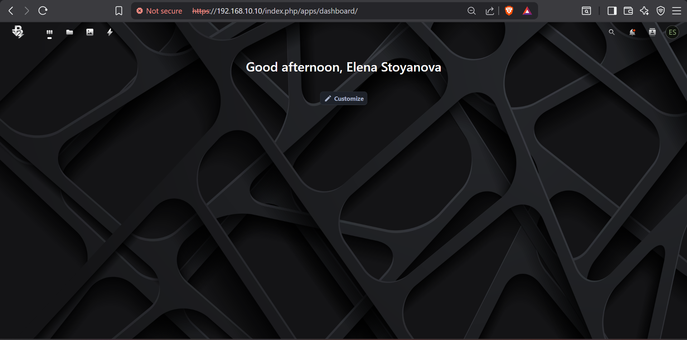

*Начален интерфейс през защитена HTTPS връзка*

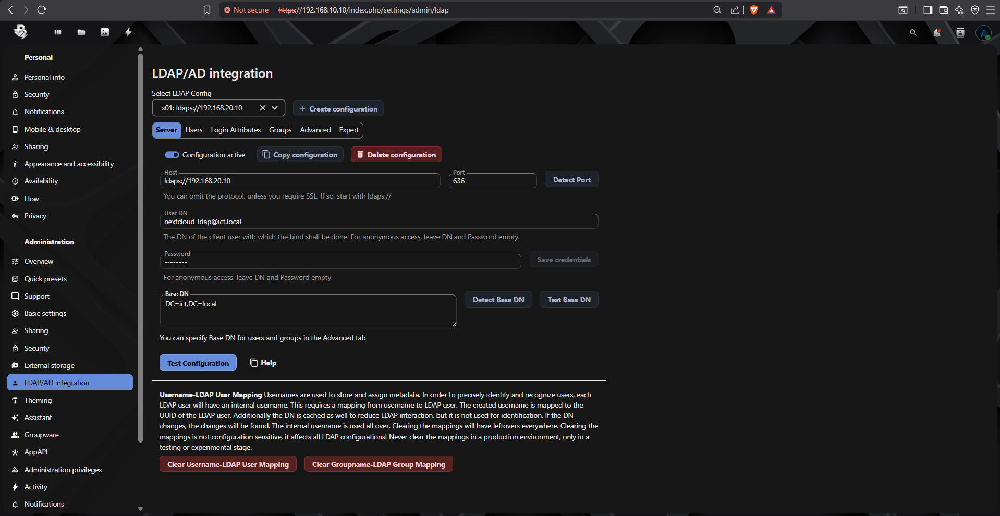

*Конфигурирана LDAP връзка към Active Directory*

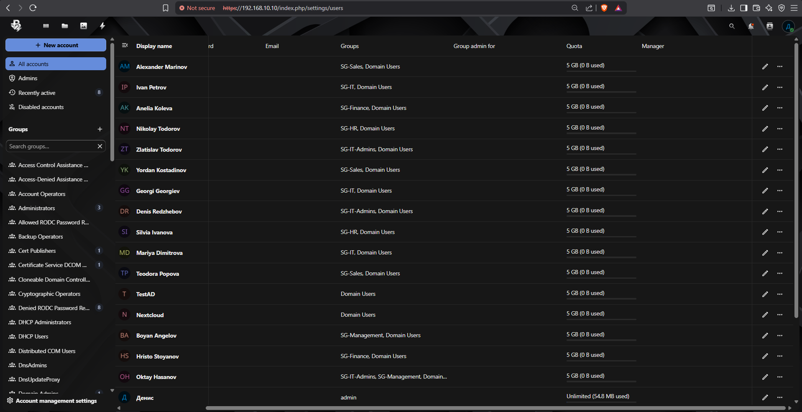

*Автоматично синхронизирани потребители и групи*

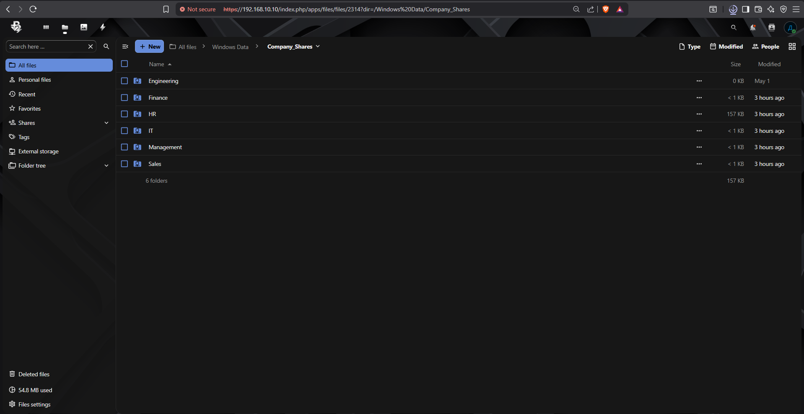

*Windows файлово хранилище, монтирано като External Storage*

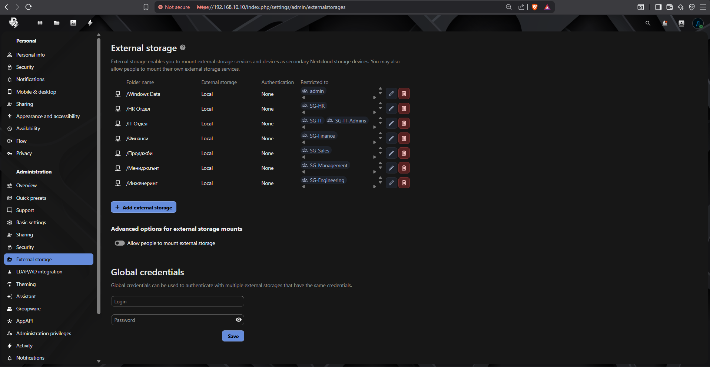

*Разпределение на правата за достъп по отдели*

---

## Пълна документация

Пълният текст на дипломната работа, включващ теоретичната част и
детайлно описание на реализацията, е достъпен тук:
[`docs/Дипломна_Работа.pdf`](docs/Дипломна_Работа.pdf)

---
